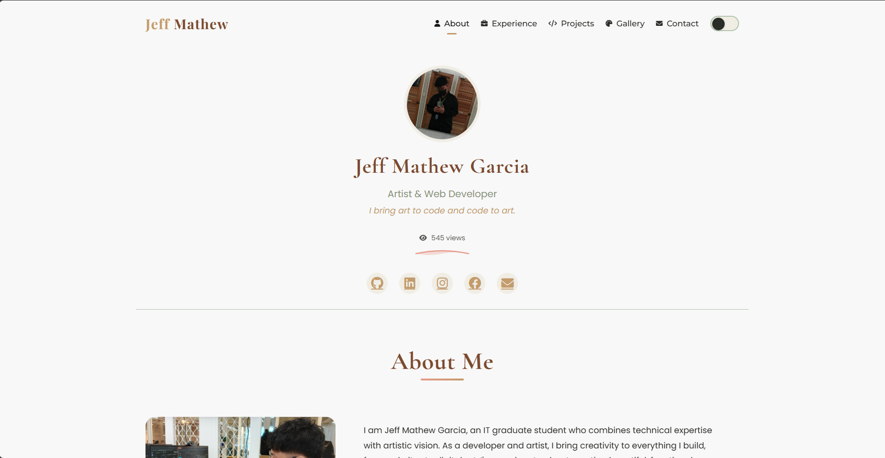

# Jeff Mathew Garcia Portfolio

Welcome to my personal portfolio website! I am Jeff Mathew Garcia, an IT graduate and artist passionate about web development, system creation, and digital art. This site showcases my projects, skills, and services, and is open for commissions.

## 🚀 Features
- Professional About Me section
- Interactive project showcase
- Art & Web/System commissions
- Blog system with Markdown support
- Contact form and social links
- Responsive and accessible design
- Dark mode support
- Google Analytics integration
- SEO optimization with JSON-LD

## 🛠️ Tech Stack
- HTML5, CSS3 (custom + Bootstrap 5.2.3)
- JavaScript (vanilla)
- Font Awesome 6.0.0 (icons)
- AOS (Animate On Scroll)
- Marked.js (for blog markdown processing)
- Google Analytics
- Bootstrap Icons

## 📦 Project Structure
```
├── assets/          # Images and media files
├── blog/           # Generated blog pages
├── components/     # Reusable HTML components
├── css/           # Stylesheets
├── js/            # JavaScript files
├── posts/         # Blog post markdown files
├── index.html     # Main portfolio page
├── projects.html  # Projects showcase
├── gallery.html   # Art gallery
└── generate-blog.js # Blog generation script
```

## 🌐 Live Demo
[GitHub Pages Link](https://shin-da.github.io/jeffmathew-portfolio/)

## 📦 Setup & Development
1. Clone the repository:
   ```bash
   git clone https://github.com/shin-da/jeffmathew-portfolio.git
   ```
2. Install dependencies:
   ```bash
   npm install
   ```
3. For blog development:
   - Add markdown files in the `posts/` directory
   - Run `node generate-blog.js` to generate blog pages
4. Open `index.html` in your browser or deploy to GitHub Pages

## 📝 Customization
- Replace images in `assets/images/` with your own
- Update project and art details in respective HTML files
- Edit styles in `css/main.css`
- Add blog posts as markdown files in `posts/` directory
- Modify `generate-blog.js` for blog template changes

## 📬 Contact
Feel free to reach out via the contact form or any of my social links!

---
Made with ❤️ by Jeff Mathew Garcia 